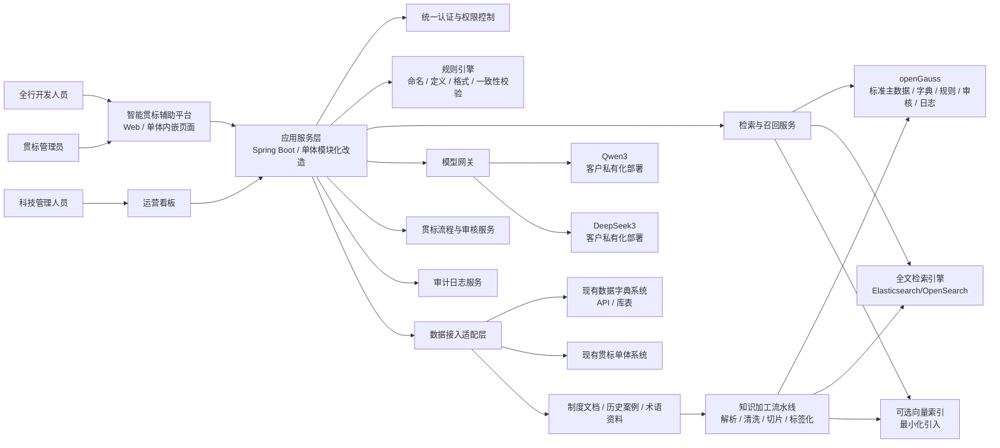
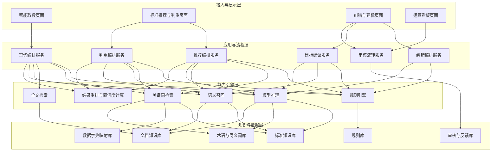
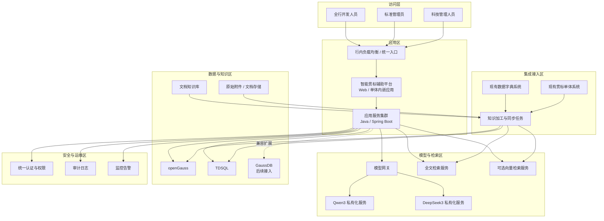
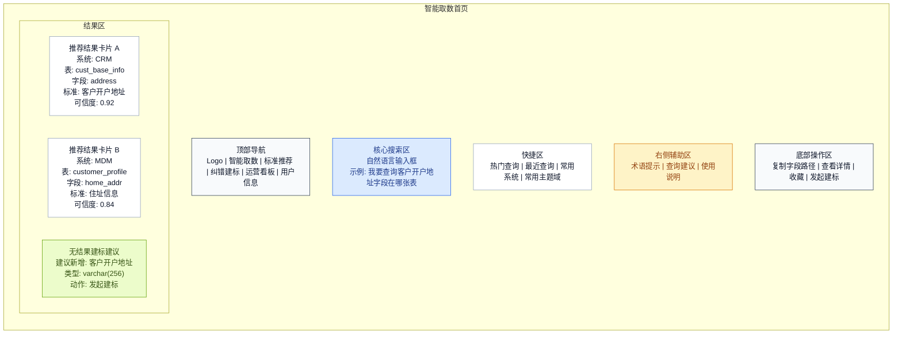
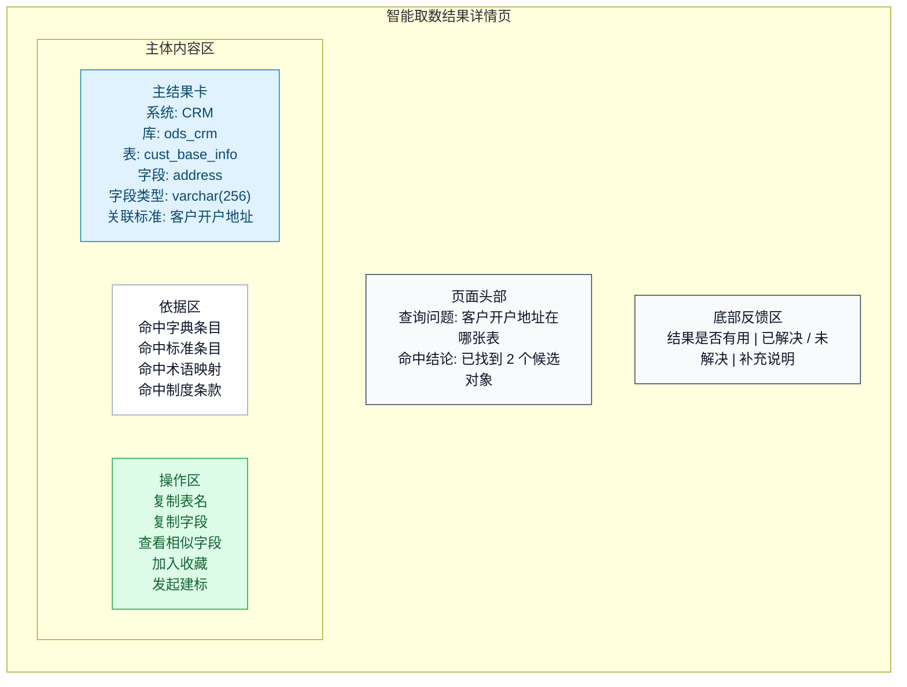
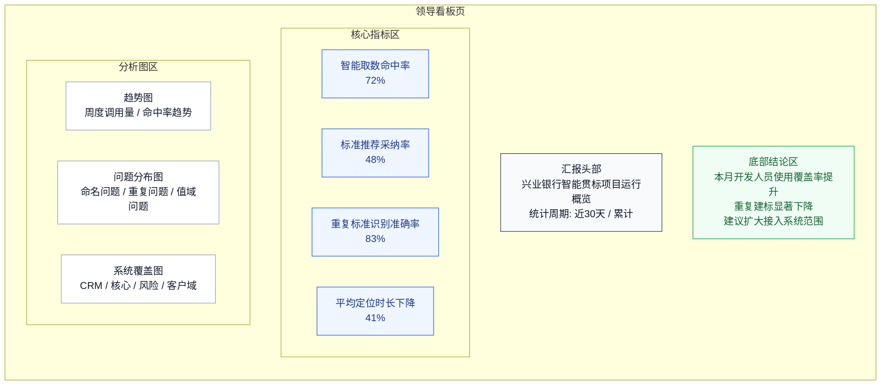

# 兴业银行智能贯标项目设计文档

## 1. 文档信息
- 项目名称：兴业银行智能贯标项目
- 文档版本：v0.3
- 文档状态：方案初稿
- 适用对象：科技部门、全行开发人员、架构评审、项目实施团队、管理层汇报场景
- 创建日期：2026-03-19
- 编写说明：本版基于已知需求与银行业通行建设经验形成，缺失项以“待确认”标记，便于后续评审补齐

## 2. 项目背景

### 2.1 客户背景
客户为中国股份制银行，现有贯标系统为兴业银行自研单体应用，已配套建设数据字典系统，且数据字典系统可通过 API 或库表方式直接接入。当前标准制定、标准复用、重复识别、错误纠偏等关键环节仍较依赖人工经验，存在效率低、主观性强、规则不统一、沉淀难复用的问题。

在监管持续强化数据安全、模型合规和信创适配的大背景下，银行需要在不改变现有贯标主流程边界的前提下，将大模型能力引入“数据字典 + 贯标”场景，形成“可建议、可解释、可审核、可追溯”的智能贯标辅助能力。

### 2.2 现状痛点
- 数据标准命名、定义、口径、值域等编制工作依赖人工，产出周期长
- 不同条线对同一业务对象存在“近义不同名、同名不同义、重复造标准”等问题
- 标准评审质量依赖专家经验，缺少统一的机器辅助检查机制
- 现有数据字典虽有较强基础，但尚未形成知识库与推理闭环
- 缺少对历史标准、监管要求、制度术语、业务术语的统一语义映射
- 人工纠错覆盖有限，且错误经验难以沉淀为可复用规则

### 2.3 项目价值
- 对开发人员：降低找数、问数、重复造字段和重复建标成本，提升开发准备效率
- 对贯标体系：沉淀“标准知识库 + 审核规则库 + 智能推荐能力”三位一体能力
- 对科技：构建符合信创要求、可私有化部署、可逐步扩展的智能贯标能力底座
- 对管理层：形成可量化、可汇报的提效成果，并建立过程留痕、结果可解释、责任可追溯的闭环

## 3. 项目目标

### 3.1 总体目标
基于现有数据字典系统，建设一套面向“数据字典维护 + 数据标准贯标”的智能辅助平台，支持：
- 智能推荐数据标准
- 重复标准检测
- 智能纠错与规范化建议
- 面向开发人员的智能取数与建标辅助
- 标准知识库建设与持续运营
- 人机协同审核与闭环反馈

### 3.2 一期建设目标
- 在不引入血缘数据库的前提下，完成智能贯标核心闭环
- 建成银行内可私有化部署的标准知识库
- 接入 `Qwen3` 和 `DeepSeek3` 两类模型能力，支持统一路由与对比调用
- 形成面向标准新增、标准变更、标准评审三类场景的智能辅助
- 形成面向开发人员的数据查询定位与缺失标准创建建议能力
- 与现有数据字典系统及自研单体贯标系统打通，实现“从字典到知识库到推荐结果”的闭环

### 3.3 成功指标
| 指标 | 当前情况 | 一期目标 | 统计口径 |
|---|---:|---:|---|
| 开发人员智能取数命中率 | 待确认 | >= 70% | 命中可直接使用对象的查询数 / 总查询数 |
| 开发人员取数平均定位时长下降 | 待确认 | >= 40% | 上线前后典型查询定位时长对比 |
| 标准推荐采纳率 | 待确认 | >= 45% | 被人工采纳的推荐数 / 总推荐数 |
| 重复标准识别准确率 | 待确认 | >= 80% | 抽样复核正确数 / 系统判重数 |
| 智能纠错命中率 | 待确认 | >= 75% | 被人工认可的纠错建议数 / 总纠错建议数 |
| 标准编制平均耗时下降 | 待确认 | >= 30% | 上线前后同类标准编制时长对比 |
| 人工评审工作量下降 | 待确认 | >= 25% | 标准评审工时对比 |
| 知识入库覆盖率 | 0 | >= 80% | 已纳入知识库的基础治理资料 / 应纳资料 |

## 4. 建设原则
- 贯标优先：先统一标准语义、知识口径和审核规则，再做模型增强
- 私有部署：模型、知识、日志、向量索引、审计能力优先内网部署
- 信创适配：应用、中间件、数据库、OS、CPU/GPU 尽量采用国产兼容路线
- 人机协同：系统只给建议，不直接绕过人工审批
- 可解释可追溯：每条推荐、判重、纠错结果都要可回溯到依据
- 小步快跑：一期聚焦“知识库 + 推荐 + 判重 + 纠错”，暂不做复杂血缘推断
- 可扩展：二期可扩展至标准变更影响分析、跨系统标准一致性巡检等能力

## 5. 行业借鉴与建设启发

### 5.1 银行同业可借鉴经验
结合公开资料，可总结出以下建设共识：

1. 先打基础平台，再做智能应用  
中国银行曾公开采购“数据字典平台”，说明头部银行通常先把数据字典和标准底座打牢，再叠加后续智能能力。

2. 标准项目要嵌入正式管理机制  
建设银行公开资料提到从企业级层面研究数据治理重大问题，并发布数据资产管理办法。对本项目的启发是：虽然范围只聚焦贯标和数据字典，但项目仍要纳入正式制度、流程和评审机制，而不是单纯做工具试点。

3. 大模型落地以私有化、平台化、多场景复用为主  
工商银行公开披露已完成 DeepSeek 开源模型私有化部署，并赋能多个业务领域和场景，说明银行采用“统一模型底座 + 多场景复用”的模式已成为主流方向。

4. 大模型与知识库要结合，而不是只做通用问答  
平安银行公开提到大模型开放平台和金融数据治理能力标准，说明银行更看重平台化、可复用能力，而非单点 Demo。

5. 数据能力建设必须服从监管、合规和安全要求  
生成式 AI 相关监管要求强调训练数据来源、类型和规则可说明，因此知识库、模型调用和审计留痕是关键能力。

### 5.2 对本项目的直接启发
- 本项目应定位为“数据字典与贯标智能升级项目”，不是泛化的数据治理平台项目
- 核心交付物应包括知识库、规则库、模型服务层、审核闭环，而不只是一个聊天界面
- 一期应优先做结构化贯标场景，避免直接切入复杂开放问答场景
- 模型能力要受规则约束，输出必须带依据、相似标准、命中规则和置信度

## 6. 项目范围

### 6.1 一期范围
- 数据标准知识库建设
- 数据字典数据接入与清洗
- 自研单体贯标系统适配改造
- 标准智能推荐
- 重复标准检测
- 智能纠错与规范性检查
- 智能取数问答与缺失标准创建建议
- 审核工作台与人工确认闭环
- 模型服务管理与审计留痕
- 基础权限、日志、统计看板

### 6.2 一期明确不做
- 血缘数据库建设与血缘推理
- 主数据、指标标准、数据质量平台等其他专项建设
- 面向终端客户的生成式对话服务
- 自动替代人工审批的“全自动发布”
- 跨机构数据共享能力

## 7. 用户角色与使用场景

### 7.1 目标用户
| 角色 | 主要职责 | 核心诉求 |
|---|---|---|
| 全行开发人员 | 查询数据、定位表字段、发起建标或复用已有标准 | 快速找数、快速判断是否已有、减少反复沟通 |
| 贯标管理员/标准管理员 | 维护数据标准、字典、口径 | 提升编制效率和一致性，降低重复审核成本 |
| 数据架构师/平台架构人员 | 统筹标准体系与命名规范 | 需要全局视角、去重能力和规则收敛能力 |
| 科技管理人员 | 查看建设成效与推广情况 | 需要看板、命中率、提效成果和可汇报指标 |

### 7.2 展示与交互原则
- 面向开发人员的页面以“查询效率、结果直达、操作简单”为优先，不采用面向业务部门的复杂术语或审批视角
- 面向管理层的展示以成果看板、命中率、提效时长、复用率、重复标准下降率等指标为主
- 同一套平台支持两类视角，但开发人员视角为主界面，管理层视角为汇报看板
### 7.3 核心场景

#### 场景A：新增标准时智能推荐
用户输入候选标准名称、中文定义、英文名、数据类型、业务域等信息后，系统自动从数据字典、历史标准、术语词表和制度资料中召回相近标准，并给出：
- 是否已有可复用标准
- 推荐标准名称与定义
- 推荐理由
- 相似标准清单
- 置信度

#### 场景B：评审时重复标准检测
在标准提交评审时，系统自动检测：
- 同义重复
- 口径近似重复
- 命名不同但业务语义相同
- 同一业务对象在不同条线重复建标

#### 场景C：编写时智能纠错
对标准名称、定义、值域、代码说明、单位、格式规则等进行自动校验，识别：
- 命名不规范
- 定义缺失关键要素
- 数据类型与值域不一致
- 枚举值描述不规范
- 与已有标准冲突

#### 场景D：知识沉淀与运营
将人工评审结论、纠错结果、优秀标准案例、监管制度术语持续沉淀到知识库和规则库中，形成持续优化闭环。

#### 场景E：开发人员智能取数
开发人员通过对话方式输入业务需求、字段含义或指标含义，系统先基于数据字典、已发布标准和知识库进行检索判断：
- 若已存在相关数据对象，则返回可用表、字段、标准名称、所在系统、字段含义，以及可选的业务背景说明
- 若存在多个候选对象，则返回候选清单、差异说明和推荐使用顺序
- 若不存在匹配对象，则结合历史建标案例、命名规范、字段模式和术语规则，给出建议新增的数据标准或字段定义草案
- 若信息不足，则引导开发人员补充业务域、对象类型、使用场景等上下文

## 8. 总体业务方案

### 8.1 业务闭环
1. 接入现有数据字典与历史标准数据
2. 建设标准知识库和规则库
3. 用户发起新增/变更/评审/查询定位操作
4. 系统执行规则校验 + 检索召回 + 模型推理
5. 返回推荐、判重、纠错、取数定位结果和依据
6. 人工确认、驳回、修订或发起建标
7. 结果反哺知识库、规则库和训练样本池

### 8.2 核心能力模块
| 模块 | 说明 | 一期优先级 |
|---|---|---|
| 知识接入模块 | 接入数据字典、标准库、制度文档、术语表 | P0 |
| 知识加工模块 | 清洗、切分、标签化、实体抽取、版本管理 | P0 |
| 标准知识库 | 存储结构化标准、非结构化文档、术语映射 | P0 |
| 规则引擎 | 命名规范、格式规范、逻辑一致性校验 | P0 |
| 智能推荐引擎 | 检索增强 + 模型生成推荐 | P0 |
| 重复检测引擎 | 相似度检测、规则判重、语义判重 | P0 |
| 智能纠错引擎 | 基于规则和模型的纠偏建议 | P0 |
| 智能取数引擎 | 面向开发人员的表字段定位、候选返回和缺失创建建议 | P0 |
| 审核工作台 | 人工确认、反馈、留痕 | P0 |
| 模型服务治理 | 模型路由、审计、灰度、效果评估 | P1 |
| 运营分析看板 | 采纳率、问题分布、知识覆盖率 | P1 |

## 9. 知识库设计

### 9.1 为什么知识库是一号重点
本项目当前没有现成知识库，而银行智能贯标场景天然不是“纯大模型问题”，而是“贯标规则 + 行内知识 + 术语上下文 + 历史标准”的组合问题。若无知识库，大模型只能给出通用性建议，难以满足银行对准确性、一致性、可解释性和可审计性的要求。

因此，一期项目成败的关键，不是模型参数多大，而是能否建设出可运营的标准知识底座。

### 9.2 知识库建设目标
- 形成统一的“标准知识源”
- 让模型回答基于行内知识而不是外部通用知识
- 支持推荐结果可追溯到具体标准、制度条款、历史案例
- 支持开发人员通过自然语言定位已有表/字段/标准，并在缺失时生成建标建议
- 支持后续扩展至更多标准类型、标准变更影响分析和跨系统一致性检查

### 9.3 知识源范围
| 知识源 | 内容 | 类型 | 一期是否纳入 |
|---|---|---|---|
| 现有数据字典系统 | 标准名称、定义、英文名、类型、值域、所属系统等 | 结构化 | 是 |
| 历史数据标准库 | 已发布、已废弃、变更中的标准 | 结构化 | 是 |
| 标准管理制度 | 命名规范、定义规范、评审规范 | 非结构化 | 是 |
| 业务术语表 | 业务域、主题域、关键术语 | 结构化/半结构化 | 是 |
| 监管制度与内部规范 | 监管口径、内部制度要求 | 非结构化 | 是 |
| 专家经验样本 | 优秀标准案例、常见错误案例 | 半结构化 | 是 |
| 元数据血缘 | 表、字段血缘关系 | 图谱/结构化 | 否 |

### 9.4 知识库逻辑分层

#### 9.4.1 原始资料层
保存原始接入数据，包括字典表、标准表、制度文档、Excel、Word、PDF 等。

#### 9.4.2 加工标准层
对知识做统一化处理：
- 去重
- 结构化映射
- 版本标记
- 标签分类
- 实体抽取
- 文档切片
- 敏感信息识别

#### 9.4.3 语义索引层
用于支持召回与语义匹配：
- 关键词索引
- 规则标签索引
- 向量索引
- 术语同义词索引

#### 9.4.4 应用服务层
向推荐、判重、纠错、审核工作台提供统一知识服务接口。

### 9.5 知识对象模型设计
建议一期至少沉淀以下核心对象：
- 数据标准
- 标准属性
- 术语
- 业务对象
- 主题域
- 监管规则
- 行内制度条款
- 错误案例
- 推荐案例
- 审核结论

建议关键字段：
- 标准ID
- 标准名称
- 中文定义
- 英文名称
- 数据类型
- 长度/精度
- 值域/代码集
- 业务域/主题域
- 来源系统
- 生命周期状态
- 生效日期
- 关联术语
- 参考制度
- 审核记录

### 9.6 知识加工策略
- 结构化优先：标准类信息优先用关系型建模，不要一开始全部扔向量库
- 文档分层切片：制度文档按“章节/条款/规则点”切分，避免过粗召回
- 统一术语归一：建立同义词、别名、缩写、历史名称映射
- 版本管理：标准与制度均需支持版本号和生效状态
- 标签化：至少按主题域、业务域、标准类型、来源系统、敏感级别打标签
- 审核反馈反哺：人工采纳/拒绝结果要写回样本池，形成后续优化依据

### 9.7 开源知识库技术路线建议
一期建议采用“应用编排与知识处理开源组件 + 自研 Java 业务系统”的组合方式，不建议把核心银行业务完全绑定在单一开源 AI 平台上。

推荐路线：
- 知识处理与文档解析层：可评估 `RAGFlow` 或同类开源组件，用于复杂文档解析、切片、索引流水线
- 核心业务平台层：采用 `Java + Spring Boot/Spring AI` 自研，确保符合银行现有技术治理体系
- 检索与索引层：关系型数据库 + 全文检索 + 可选向量检索混合架构

原因：
- 银行最终交付更看重可控、可维护、可审计
- 知识库是长期资产，不宜深度绑定轻量化 AI Demo 平台
- Java 更适合融入现有行内中后台体系、权限、流程、接口和运维框架

### 9.8 开源知识库建议
结合本项目“银行内网私有化、开发人员主用、Java 主技术栈、数据字典 + 贯标知识为核心”的特点，建议优先考虑以下 2 条路线：

#### 建议一：RAGFlow
定位：偏企业级知识处理与 RAG 编排的开源平台，适合作为知识加工、文档解析、切片、检索流水线底座。

适合原因：
- 对文档解析、切片、检索流程支持较完整，适合制度文档、历史案例、规范文档入库
- 更适合承担“知识处理层”，减少团队从零开发文档知识流水线的工作量
- 可私有化部署，便于放在银行内网环境

在本项目中的建议用法：
- 用于制度文档、案例文档、术语资料的解析和切片
- 用于构建文档类知识索引
- 不直接承载核心业务流程、权限主逻辑和审核主流程

注意点：
- 银行业项目中不建议把核心贯标业务完全绑定在其应用层
- 需要额外补足行内认证、权限、审计和菜单集成

#### 建议二：Spring AI + 自研知识服务
定位：不是完整的现成知识库产品，而是基于 Java 技术栈构建自研知识服务的更稳路线。

适合原因：
- 与现有单体 Java 体系兼容度高，便于融入现有代码、权限、流程和运维体系
- 适合把“标准主数据、术语映射、规则库、AI 编排”统一纳入本项目可控范围
- 更符合银行项目对可维护性、审计性和可控性的要求

在本项目中的建议用法：
- 用 `Spring AI` 负责模型接入、RAG 编排、检索增强调用
- 用自研 Java 服务承载标准知识库、术语库、规则库、反馈回流和审核闭环
- 文档知识处理部分可与 `RAGFlow` 组合使用，也可后续逐步自研替换

注意点：
- 初期建设成本高于直接上完整开源平台
- 需要团队具备较强 Java 架构与 AI 工程整合能力

#### 本项目推荐结论
- 若希望一期更快落地：推荐 `RAGFlow + Java 自研业务层`
- 若希望长期更强可控：推荐 `Spring AI + Java 自研知识服务`
- 不建议一期把所有能力都压在单一开源知识库平台上

#### RAGFlow 与 Spring AI 自研路线对比表
| 对比项 | RAGFlow | Spring AI + Java自研知识服务 |
|---|---|---|
| 定位 | 开源知识处理与RAG平台 | Java 技术栈下的自研知识服务路线 |
| 上手速度 | 快，适合一期快速搭建文档知识能力 | 中等，前期设计和开发投入更高 |
| 与现有单体融合 | 中，需要适配认证、菜单、权限、审计 | 高，天然适合融入现有 Java 单体与模块化改造 |
| 文档解析能力 | 强，适合文档入库、切片、检索流水线 | 中，需要自行补齐或组合其他组件 |
| 结构化知识管理 | 中，需结合业务系统补强 | 强，可按项目要求定制标准库、术语库、规则库 |
| 审核闭环承载 | 弱，不建议承载主审核流程 | 强，适合承载采纳、驳回、回写、留痕 |
| 权限与审计可控性 | 中，需要二次集成 | 高，便于按银行标准统一设计 |
| 长期可维护性 | 中，依赖平台演进和二次适配 | 高，更符合银行项目长期维护模式 |
| 适合场景 | 一期快速落地文档知识处理 | 长期核心业务能力沉淀 |
| 本项目建议 | 适合作为知识处理层 | 适合作为核心业务与知识服务层 |
### 9.9 合规与监管要求下的知识库约束
- 全量私有化部署，禁止知识数据出行
- 对接内部统一身份认证与权限体系
- 文档入库前执行敏感识别、脱敏或分级控制
- 检索结果带来源追踪信息
- 保留知识入库、更新、访问、命中、导出等审计日志
- 模型调用不得绕过权限边界
- 对外服务与内部服务分域隔离
- 与现有自研单体贯标系统的权限、菜单、流程边界保持一致

## 10. 智能能力设计

### 10.1 智能推荐设计
推荐目标是帮助用户复用现有标准或生成候选标准草案，而不是直接替代人工决策。

推荐流程：
1. 用户输入候选标准信息
2. 系统执行关键词召回、同义词召回、向量召回
3. 基于规则过滤掉明显不相关结果
4. 将候选相似标准、制度条款、历史案例送入模型
5. 模型输出推荐结果、理由、差异点、依据来源
6. 用户确认采纳、调整或拒绝

推荐输出结构建议：
- 推荐结论：建议复用 / 建议新增 / 建议合并 / 建议修改
- 推荐标准候选 TopN
- 推荐理由
- 相似度分值
- 命中规则
- 参考依据
- 风险提示

### 10.2 重复标准检测设计
重复检测采用“三层判重”：

1. 规则判重  
名称完全相同、英文名相同、编码相同、关键属性完全一致。

2. 近似判重  
基于分词、同义词、编辑距离、字段属性相似度计算近似重复。

3. 语义判重  
基于 embedding 和大模型判断“是否为同一业务语义对象”。

建议输出：
- 重复级别：高 / 中 / 低
- 重复类型：完全重复 / 近义重复 / 口径冲突 / 命名冲突
- 证据链：命中字段、相似标准、差异项

### 10.3 智能纠错设计
纠错能力由“硬规则 + 软规则 + 模型推理”组成。

硬规则：
- 命名长度
- 禁用词
- 命名格式
- 类型和值域一致性
- 枚举值描述规范

软规则：
- 定义是否完整
- 是否缺少业务主语/限定条件
- 术语是否与统一词表一致
- 是否存在表达歧义

模型推理：
- 给出更规范的定义改写
- 提示与历史标准的差异
- 输出建议修订版本

### 10.4 人机协同原则
- 系统输出必须是“建议态”
- 高风险变更必须保留人工审批
- 支持“采纳/部分采纳/驳回/加入规则”四类反馈
- 对高频驳回建议进行规则或提示词优化

### 10.5 智能取数能力设计
智能取数能力面向全行开发人员，但服务边界仍限定在数据字典与贯标相关范围，不直接替代数据服务平台或统一数据门户。

处理流程建议如下：
1. 开发人员以自然语言描述“我要什么数据”
2. 系统识别业务对象、时间范围、字段语义、可能的系统域
3. 先检索数据字典、标准库、术语库和历史案例
4. 若命中，返回表名、字段名、字段定义、所属系统、关联标准及可选业务说明
5. 若命中多个候选，按置信度和适配度排序，并说明差异
6. 若未命中，基于知识库和历史样本生成“建议新增标准/字段”的草案
7. 开发人员可一键复制结果，或转入贯标创建流程

建议输出结构：
- 查询结论：已存在 / 存在候选 / 暂未发现
- 推荐对象：表名、字段名、标准名称
- 位置信息：系统、库、表、字段
- 语义说明：字段定义、业务口径、使用限制
- 可信依据：命中的字典条目、标准条目、制度条款
- 后续动作：直接使用 / 人工确认 / 发起新增建标

## 11. 技术架构设计

### 11.1 总体架构
建议采用“1个贯标辅助平台、3个智能引擎、2类存储、1个模型网关”的总体架构。

1个平台：
- 智能贯标辅助平台

3个引擎：
- 推荐引擎
- 判重引擎
- 纠错引擎

2类存储：
- 关系型数据库：承载标准主数据、规则、审核、日志
- 检索存储：承载全文索引与可选向量索引

1个模型网关：
- 统一接入 Qwen3、DeepSeek3，支持路由、限流、审计和灰度

### 11.2 应用技术栈建议
| 层级    | 建议技术                                     |
| ----- | ---------------------------------------- |
| 前端    | 兴业现网 Vue 技术体系（建议 Vue 3，按行内统一组件体系实施）      |
| 后端    | Java 17/21 + Spring Boot，结合现有单体架构进行模块化改造 |
| AI 集成 | Spring AI 或企业统一 AI SDK                   |
| 规则引擎  | Drools / Aviator / 自研规则中心                |
| 检索引擎  | Elasticsearch / OpenSearch（按行内准入）        |
| 关系数据库 | openGauss、TDSQL，后续兼容商用版 GaussDB          |
| 缓存    | Redis 或国产兼容缓存                            |
| 消息队列  | RocketMQ / Kafka（按客户标准）                  |
| 模型推理层 | vLLM / SGLang / 行内统一推理平台                 |
| 部署    | K8s / OpenShift / 行内部署平台                 |

### 11.3 信创适配建议
建议以“Java 应用 + 国产 OS + 国产数据库 + 国产 CPU/GPU 兼容”的路线设计。

推荐原则：
- OS 优先适配统信 UOS、麒麟等国产系统
- 数据库优先适配客户现网已准入的 `openGauss`、`TDSQL`，并为后续接入商用版 `GaussDB` 预留兼容设计
- 模型推理优先对接客户已私有化部署的 `Qwen3` 与 `DeepSeek3`，本项目不重复建设底层模型训练平台
- 第三方组件需完成许可证、漏洞、安全和国产化适配评估

### 11.4 数据库兼容设计说明
本项目数据库方案需满足“当前支持 `openGauss`、`TDSQL`，后续平滑兼容商用版 `GaussDB`”的要求，因此数据库设计应遵循“主业务表结构统一、数据库差异隔离、检索能力外置、迁移成本可控”的原则。

#### 11.4.1 支持数据库范围
- 当前主支持：`openGauss`
- 当前并行兼容：`TDSQL`
- 后续兼容扩展：商用版 `GaussDB`

#### 11.4.2 存储分工建议
关系型数据库承载：
- 标准主表
- 标准属性表
- 术语表
- 规则表
- 审核表
- 任务表
- 日志表

可选向量存储仅用于：
- 制度文档语义检索
- 定义文本相似检索
- 标准推荐召回

不建议一期把全部贯标相关数据都做成向量化存储。

#### 11.4.3 兼容设计原则
- 核心业务表设计尽量采用通用 SQL 与 JDBC 访问层，避免深度绑定单一数据库方言
- 对 `openGauss`、`TDSQL` 和 `GaussDB` 的差异点，通过 DAO 层、SQL 适配层或 ORM 方言配置封装
- 分页、批量写入、JSON 字段、字符串函数等易产生差异的能力要单独封装
- 全文检索、向量检索、批量导入等能力尽量外置，避免数据库能力差异影响主业务
- 一期默认以 `openGauss` 为主设计标准表结构，同时预留 `TDSQL` 部署和 `GaussDB` 迁移兼容性

#### 11.4.4 兼容落地建议
- 应用层统一使用 Repository / DAO 接口，屏蔽底层 SQL 差异
- DDL 设计以通用字段类型为主，避免过多依赖特定数据库扩展类型
- 建议建立 3 套基础验证脚本：建表验证、核心查询验证、批量导入验证
- 在 SIT/UAT 阶段至少完成一次 `openGauss` 与 `TDSQL` 双环境验证
- 对后续 `GaussDB` 接入，优先通过 SQL 兼容性验证与压测确认迁移成本

### 11.5 向量数据库选型建议
一期可以考虑向量能力，但应满足以下原则：
- 开源可私有化部署
- 支持内网部署
- 支持审计与权限隔离
- 最好能兼容现有数据库体系，避免引入过多新基础设施

建议方案优先级：

方案A：关系库 + 全文检索为主，向量能力最小化  
适合监管要求高、基础设施收敛要求高的银行项目。

方案B：在 `openGauss` 兼容体系或周边检索体系上叠加向量能力  
适合希望减少独立向量数据库运维复杂度的场景。

方案C：独立开源向量数据库（如 Milvus）  
适合后续语义检索规模明显增大时使用，但需额外完成安全和信创评估。

本项目一期建议优先选 A 或 B，避免架构过重。

### 11.6 系统架构图

### 11.7 模块架构图

### 11.8 部署拓扑图

### 11.9 技术交付拆分建议
为便于一期实施与验收，建议按以下交付包拆分：

| 交付包 | 主要内容 | 输出物 |
|---|---|---|
| 交付包1：基础接入 | 数据字典接入、制度文档入库、单体系统菜单与权限接入 | 接口清单、接入方案、联调记录 |
| 交付包2：知识库底座 | 知识模型、表结构、清洗规则、切片规则、索引构建 | 数据模型设计、DDL、知识加工任务 |
| 交付包3：智能能力 | 推荐、判重、纠错、智能取数、建标建议 | 服务接口、提示词模板、规则集 |
| 交付包4：流程与审核 | 建议采纳、驳回、回写、审核留痕 | 流程设计、状态机、操作日志 |
| 交付包5：运营与审计 | 看板、调用日志、审计日志、效果评估 | 看板指标口径、审计方案、评估报告 |

### 11.10 关键接口设计建议
一期建议优先沉淀以下服务接口：

| 接口 | 方法 | 说明 |
|---|---|---|
| `/api/ai/query-data` | POST | 开发人员自然语言查询表/字段/标准 |
| `/api/ai/recommend-standard` | POST | 输入标准草案，返回推荐标准候选 |
| `/api/ai/check-duplicate` | POST | 对单条或批量标准执行重复检测 |
| `/api/ai/check-standard` | POST | 返回命名、定义、属性一致性纠错建议 |
| `/api/ai/suggest-standard` | POST | 在未命中现有标准时生成新增建标建议 |
| `/api/knowledge/import` | POST | 导入字典、文档、术语、案例知识 |
| `/api/review/submit-feedback` | POST | 提交采纳、驳回、修订反馈 |
| `/api/dashboard/metrics` | GET | 返回看板指标数据 |

## 12. 模型设计

### 12.1 模型定位
- `Qwen3`：适合通用理解、中文语义生成、标准定义改写与基础推荐
- `DeepSeek3`：适合复杂推理、相似标准对比、判重复核和规则解释

### 12.2 模型使用方式
建议采用“客户自带双模型 + 统一网关 + 场景路由”的方式：
- 推荐场景：优先 Qwen3，必要时调用 DeepSeek3 复核
- 判重场景：先规则与检索，再由 DeepSeek3 做语义判断
- 纠错场景：规则引擎优先，Qwen3/DeepSeek3 做语言优化和补充说明

### 12.3 模型调用策略
- 先检索后生成，禁止裸问模型
- 低风险场景单模型输出
- 高风险场景双模型交叉校验
- 超过阈值的不确定结果直接提示人工复核
- 输出模板化，避免自由发挥

### 12.4 Prompt 与输出约束
模型输出必须结构化：
- 推荐结论
- 理由
- 参考标准
- 参考制度
- 风险点
- 置信度
- 建议动作

禁止：
- 无依据直接结论
- 访问权限外内容
- 输出不可解释的黑盒判断

## 13. 功能设计

### 13.1 功能一：标准智能推荐
- 输入：标准名称、定义、数据类型、业务域、来源系统
- 输出：候选标准、复用建议、差异点、依据说明
- 价值：减少重复建标，提高标准复用率

### 13.2 功能二：重复标准检测
- 输入：待评审标准或标准批量清单
- 输出：疑似重复列表、重复级别、冲突说明
- 价值：降低冗余标准数量，提升标准一致性

### 13.3 功能三：智能纠错
- 输入：标准草案
- 输出：命名规范建议、定义修订建议、属性一致性校验结果
- 价值：降低低级错误，提高评审质量

### 13.4 功能四：智能取数与建标辅助
- 输入：开发人员的自然语言查询、业务关键词、字段需求描述
- 输出：
  - 已存在时：表/字段位置、所属系统、关联标准、字段定义、可选业务说明
  - 不存在时：建议新增的标准名称、字段定义、数据类型、命名建议、参考样例
- 价值：减少开发人员反复找数、问数和重复造字段的问题

### 13.5 功能五：知识库运营
- 知识导入
- 知识版本管理
- 术语维护
- 规则配置
- 样本反馈回流
- 知识质量巡检

### 13.6 功能六：审核工作台
- 待审核任务列表
- AI 建议展示
- 一键采纳/部分采纳/驳回
- 审核意见留痕
- 反馈回流

### 13.7 功能七：贯标运营看板
- 推荐调用量
- 采纳率
- 判重命中率
- 智能取数命中率
- 开发人员使用覆盖率
- 平均定位时长下降
- 高频错误分布
- 各场景标准问题分布
- 知识覆盖率

### 13.8 页面级原型说明

#### 13.8.1 页面一：智能取数首页
页面定位：面向全行开发人员的高频入口页，目标是让用户在最短路径内完成“查表、查字段、查标准、无结果时给出建标建议”。

页面结构建议：
- 顶部区域：系统标题、当前用户、帮助入口、历史记录入口
- 中心输入区：自然语言输入框，支持示例提示词
- 快捷入口区：最近查询、热门查询、常用系统、常用主题域
- 结果展示区：默认空态，查询后展示匹配结果
- 右侧辅助区：查询建议、术语提示、使用说明

核心组件说明：
- 输入框：支持“我要查询客户开户地址”“哪里有贷款余额字段”这类自然语言输入
- 示例提示：显示 3-5 个推荐问题模板，降低首次使用门槛
- 历史记录：展示最近 10 次查询，支持一键再次查询
- 结果卡片：展示表名、字段名、系统名称、字段说明、关联标准、可信度
- 操作按钮：复制表字段、查看详情、加入收藏、发起建标

交互流程：
1. 用户输入自然语言问题并提交
2. 系统展示“检索中”状态，并返回命中结果或候选结果
3. 若命中唯一结果，优先以卡片方式直接展示
4. 若命中多个候选，按列表展示并标注推荐顺序
5. 若未命中，展示“建议新增建标”区域

状态设计：
- 空状态：展示引导文案、示例问题、热门查询
- 加载状态：展示进度提示和当前正在执行的步骤
- 结果状态：展示结果卡片、来源依据、后续操作
- 无结果状态：展示未命中提示和新增建标建议入口
- 异常状态：展示失败原因、重试按钮和人工支持入口

#### 13.8.2 页面二：智能取数结果详情页
页面定位：用于承接首页查询后的深度查看，适合开发人员确认是否可直接使用。

页面结构建议：
- 顶部摘要区：查询问题、命中结论、推荐对象数量
- 左侧主结果区：推荐表/字段详情
- 中部依据区：命中的标准、术语、制度、历史案例
- 右侧操作区：复制SQL片段、复制表字段、收藏、发起建标
- 底部反馈区：结果是否有用、是否采纳、补充说明

展示字段建议：
- 系统名称
- 库名 / schema / 表名 / 字段名
- 字段类型
- 字段定义
- 关联标准名称
- 推荐理由
- 注意事项或使用限制

交互动作：
- 一键复制表字段路径
- 一键复制字段清单
- 查看相似字段
- 标记“已解决”或“未解决”
- 跳转到新增建标页

#### 13.8.3 页面三：标准推荐与判重页
页面定位：面向标准管理员和架构人员，用于在新增或变更标准时获取推荐结果与重复风险。

页面结构建议：
- 左侧录入区：标准名称、英文名、定义、数据类型、值域、来源系统
- 中间结果区：推荐标准列表、重复检测结果、差异说明
- 右侧依据区：命中规则、命中知识条目、模型说明

关键展示：
- 推荐结论
- 相似标准 TopN
- 重复级别
- 冲突说明
- 可采纳建议

操作按钮：
- 采纳推荐
- 仅采纳部分字段
- 继续新建
- 标记误报
- 提交审核

#### 13.8.4 页面四：智能纠错与建标页
页面定位：用于标准草案修订与未命中场景下的建标建议承接。

页面结构建议：
- 顶部步骤条：录入草案 -> 系统检查 -> 修订确认 -> 提交审核
- 左侧草案编辑区：可编辑的标准名称、定义、属性、值域
- 右侧检查区：错误清单、修改建议、规范参考
- 底部对比区：原始内容与建议内容比对

关键功能：
- 高亮错误字段
- 显示规则命中原因
- 支持一键采纳系统建议
- 支持人工修改后再次校验
- 支持从“智能取数无结果”直接带入建标草案

#### 13.8.5 页面五：知识库运营页
页面定位：面向标准管理员，负责知识导入、规则维护和知识质量管理。

页面结构建议：
- 顶部筛选区：知识类型、状态、来源系统、时间范围
- 左侧导航区：标准知识、术语库、规则库、文档库、案例库
- 中间列表区：知识条目列表
- 右侧详情区：条目内容、版本、标签、关联关系

关键功能：
- 导入字典和文档
- 触发知识解析与重建索引
- 维护术语同义词
- 配置规则启停
- 查看知识命中情况

#### 13.8.6 页面六：审核工作台
页面定位：面向标准管理员和架构人员，承接推荐、判重、纠错、建标建议后的人工确认。

页面结构建议：
- 顶部统计区：待审核数、今日处理数、超时任务数
- 左侧任务列表：按状态、优先级、来源场景筛选
- 中部内容区：当前任务详情和AI建议
- 右侧操作区：采纳、部分采纳、驳回、退回修改

关键交互：
- 支持逐条审核
- 支持批量处理低风险项
- 支持填写驳回原因
- 支持把人工结论沉淀为新规则或新知识

#### 13.8.7 页面七：运营看板页
页面定位：面向科技管理人员和领导汇报场景，用于展示项目价值和推广效果。

页面结构建议：
- 顶部核心指标区：智能取数命中率、标准推荐采纳率、重复标准识别准确率、平均定位时长下降
- 中部分析图区：趋势图、分布图、问题类型排行
- 底部明细区：按系统、场景、部门的使用与效果明细

展示原则：
- 指标少而关键，避免堆砌技术细节
- 默认展示近30天和累计两种口径
- 支持一键导出汇报截图或报表

#### 13.8.8 导航与权限建议
- 一级导航建议：智能取数、标准推荐、纠错建标、知识运营、审核工作台、运营看板
- 开发人员默认看到：智能取数、历史记录、个人收藏
- 标准管理员默认看到：推荐、纠错、知识运营、审核工作台
- 科技管理人员默认看到：运营看板和关键指标概览

### 13.9 高保真页面示意图
以下页面图用于 `v0.3` 汇报与评审展示，目标是让领导、产品、研发对页面最终形态形成更直观的一致理解。此处为高保真示意图，不等同于最终 UI 视觉稿。

#### 13.9.1 智能取数首页高保真示意图

#### 13.9.2 智能取数结果详情页高保真示意图

#### 13.9.3 领导看板页高保真示意图

#### 13.9.4 高保真图使用建议
- 对外汇报时优先展示“智能取数首页”和“领导看板页”
- 对研发评审时优先展示“结果详情页”，便于讨论字段展示和操作闭环
- 若后续进入 UI 设计阶段，可基于这 3 张示意图继续细化为正式视觉稿

## 14. 数据设计

### 14.1 核心实体
| 实体 | 说明 |
|---|---|
| standard | 数据标准主实体 |
| standard_attr | 标准属性实体 |
| term | 业务术语实体 |
| rule | 贯标规则实体 |
| knowledge_doc | 知识文档实体 |
| data_asset_ref | 数据资产定位实体，用于记录系统/库/表/字段映射 |
| review_task | 审核任务实体 |
| ai_result | AI 建议结果实体 |
| feedback | 人工反馈实体 |

### 14.2 关键关系
- 一个标准可关联多个术语
- 一个标准可关联多个表/字段定位信息
- 一个标准可关联多个参考制度条款
- 一个审核任务可产生多条 AI 建议
- 一条 AI 建议可对应多条反馈记录

### 14.3 数据留痕
必须记录：
- 谁在什么时间发起了什么操作
- 模型版本
- 提示词版本
- 知识召回版本
- 命中知识条目
- 最终人工决策

### 14.4 知识库核心表设计

#### 14.4.1 `std_standard` 标准主表
| 字段 | 类型建议 | 说明 |
|---|---|---|
| id | bigint | 主键 |
| standard_code | varchar(64) | 标准编码 |
| standard_name_cn | varchar(256) | 标准中文名称 |
| standard_name_en | varchar(256) | 标准英文名称 |
| definition_text | text | 标准定义 |
| business_domain | varchar(128) | 业务域 |
| subject_domain | varchar(128) | 主题域 |
| standard_type | varchar(64) | 标准类型 |
| status | varchar(32) | 草稿/生效/废弃 |
| source_system | varchar(128) | 来源系统 |
| version_no | varchar(32) | 版本号 |
| effective_date | date | 生效日期 |
| created_by | varchar(64) | 创建人 |
| created_at | timestamp | 创建时间 |
| updated_by | varchar(64) | 更新人 |
| updated_at | timestamp | 更新时间 |

#### 14.4.2 `std_standard_attr` 标准属性表
| 字段 | 类型建议 | 说明 |
|---|---|---|
| id | bigint | 主键 |
| standard_id | bigint | 关联 `std_standard.id` |
| attr_name | varchar(128) | 属性名 |
| data_type | varchar(64) | 数据类型 |
| data_length | int | 长度 |
| data_precision | int | 精度 |
| data_scale | int | 小数位 |
| nullable_flag | char(1) | 是否可空 |
| default_value | varchar(256) | 默认值 |
| value_domain | text | 值域说明 |
| code_set_ref | varchar(128) | 代码集引用 |
| format_rule | varchar(256) | 格式规则 |
| unit_name | varchar(64) | 单位 |
| created_at | timestamp | 创建时间 |
| updated_at | timestamp | 更新时间 |

#### 14.4.3 `std_term` 术语表
| 字段 | 类型建议 | 说明 |
|---|---|---|
| id | bigint | 主键 |
| term_name | varchar(256) | 术语名称 |
| term_alias | varchar(512) | 别名/缩写 |
| term_definition | text | 术语定义 |
| term_category | varchar(64) | 术语分类 |
| business_domain | varchar(128) | 所属业务域 |
| status | varchar(32) | 状态 |
| created_at | timestamp | 创建时间 |
| updated_at | timestamp | 更新时间 |

#### 14.4.4 `std_term_mapping` 术语映射表
| 字段 | 类型建议 | 说明 |
|---|---|---|
| id | bigint | 主键 |
| term_id | bigint | 关联术语ID |
| standard_id | bigint | 关联标准ID |
| mapping_type | varchar(64) | 同义/上位/下位/引用 |
| confidence_score | decimal(5,4) | 映射置信度 |
| source_type | varchar(64) | 人工/规则/模型 |
| created_at | timestamp | 创建时间 |

#### 14.4.5 `std_rule` 规则表
| 字段 | 类型建议 | 说明 |
|---|---|---|
| id | bigint | 主键 |
| rule_code | varchar(64) | 规则编码 |
| rule_name | varchar(256) | 规则名称 |
| rule_type | varchar(64) | 命名/定义/类型一致性/判重 |
| rule_level | varchar(32) | 强制/提示 |
| rule_expr | text | 规则表达式或脚本 |
| rule_desc | text | 规则说明 |
| enabled_flag | char(1) | 是否启用 |
| version_no | varchar(32) | 版本号 |
| created_at | timestamp | 创建时间 |
| updated_at | timestamp | 更新时间 |

#### 14.4.6 `kb_document` 文档知识表
| 字段 | 类型建议 | 说明 |
|---|---|---|
| id | bigint | 主键 |
| doc_code | varchar(64) | 文档编码 |
| doc_name | varchar(256) | 文档名称 |
| doc_type | varchar(64) | 制度/规范/案例/说明 |
| source_path | varchar(512) | 原始文件路径 |
| source_system | varchar(128) | 来源系统 |
| version_no | varchar(32) | 版本号 |
| status | varchar(32) | 状态 |
| security_level | varchar(32) | 敏感级别 |
| parsed_flag | char(1) | 是否完成解析 |
| created_at | timestamp | 创建时间 |
| updated_at | timestamp | 更新时间 |

#### 14.4.7 `kb_document_chunk` 文档切片表
| 字段 | 类型建议 | 说明 |
|---|---|---|
| id | bigint | 主键 |
| doc_id | bigint | 关联 `kb_document.id` |
| chunk_no | int | 切片序号 |
| chapter_path | varchar(512) | 章节路径 |
| chunk_text | text | 切片正文 |
| keyword_tags | varchar(512) | 关键词标签 |
| vector_ref | varchar(128) | 向量索引引用，可空 |
| created_at | timestamp | 创建时间 |

#### 14.4.8 `std_data_asset_ref` 数据资产定位表
| 字段 | 类型建议 | 说明 |
|---|---|---|
| id | bigint | 主键 |
| standard_id | bigint | 关联标准ID |
| system_code | varchar(128) | 系统编码 |
| system_name | varchar(256) | 系统名称 |
| db_name | varchar(128) | 库名 |
| schema_name | varchar(128) | schema名 |
| table_name | varchar(256) | 表名 |
| column_name | varchar(256) | 字段名 |
| column_type | varchar(64) | 字段类型 |
| column_desc | text | 字段说明 |
| usage_desc | text | 使用说明 |
| active_flag | char(1) | 是否有效 |
| created_at | timestamp | 创建时间 |
| updated_at | timestamp | 更新时间 |

#### 14.4.9 `ai_result_record` AI结果记录表
| 字段 | 类型建议 | 说明 |
|---|---|---|
| id | bigint | 主键 |
| biz_type | varchar(64) | query-data / recommend / duplicate / correct |
| biz_id | varchar(64) | 业务单号或任务号 |
| user_id | varchar(64) | 用户ID |
| model_name | varchar(128) | 模型名称 |
| model_version | varchar(64) | 模型版本 |
| prompt_version | varchar(64) | 提示词版本 |
| input_text | text | 输入内容 |
| output_text | text | 输出内容 |
| confidence_score | decimal(5,4) | 置信度 |
| hit_knowledge_refs | text | 命中知识条目 |
| decision_status | varchar(32) | 待确认/已采纳/已驳回 |
| created_at | timestamp | 创建时间 |

#### 14.4.10 `std_feedback_record` 反馈记录表
| 字段 | 类型建议 | 说明 |
|---|---|---|
| id | bigint | 主键 |
| ai_result_id | bigint | 关联AI结果ID |
| feedback_type | varchar(32) | 采纳/部分采纳/驳回/转建标 |
| feedback_comment | text | 反馈意见 |
| operator_id | varchar(64) | 操作人 |
| operated_at | timestamp | 操作时间 |

### 14.5 知识库表关系说明
- `std_standard` 是标准主实体，关联 `std_standard_attr`、`std_term_mapping`、`std_data_asset_ref`
- `std_term` 与 `std_standard` 通过 `std_term_mapping` 建立术语归一关系
- `kb_document` 与 `kb_document_chunk` 构成文档知识存储主体
- `std_rule` 支撑推荐、判重、纠错和建标建议的规则执行
- `ai_result_record` 与 `std_feedback_record` 构成人机协同优化闭环

### 14.6 一期DDL与索引建议
- 为 `std_standard.standard_name_cn`、`std_standard.standard_name_en` 建立唯一或准唯一索引
- 为 `std_standard.business_domain`、`std_standard.subject_domain` 建立组合检索索引
- 为 `std_data_asset_ref.table_name`、`std_data_asset_ref.column_name` 建立查询索引
- 为 `std_term.term_name`、`std_term.term_alias` 建立术语检索索引
- 为 `kb_document_chunk.chunk_text` 建立全文检索索引
- 为 `ai_result_record.biz_type`、`ai_result_record.created_at` 建立统计分析索引

## 15. 安全与合规设计

### 15.1 基础原则
- 数据不出域
- 最小权限访问
- 敏感数据分级分类
- 过程全量审计
- 模型输出可追溯

### 15.2 必须满足的合规控制
- 对接行内统一认证和授权
- 不同条线、不同角色按数据权限隔离知识访问
- 敏感文档禁止被低权限用户检索命中
- 日志、知识、模型服务分域部署
- 模型请求与响应保留审计记录
- 对后续若扩展至对外服务场景，应单独评估生成式 AI 备案与安全要求

### 15.3 风险控制
| 风险 | 描述 | 应对 |
|---|---|---|
| 幻觉风险 | 模型生成不准 | 强制检索增强、输出依据、人工复核 |
| 越权风险 | 命中无权限知识 | 检索前置权限过滤 |
| 错误采纳风险 | 用户误采纳建议 | 高风险操作二次确认 |
| 知识污染风险 | 错误文档入库 | 建立知识审核流程 |
| 组件不合规风险 | 开源组件不满足行内要求 | 提前完成安全与许可证评估 |

## 16. 实施计划建议

### 16.1 阶段划分
| 阶段 | 周期建议 | 主要输出 |
|---|---|---|
| 阶段1：调研与蓝图 | 2-4周 | 单体系统现状调研、蓝图设计、数据盘点 |
| 阶段2：知识库底座建设 | 4-6周 | 数据字典接入、知识模型、规则梳理 |
| 阶段3：核心能力开发 | 6-8周 | 推荐、判重、纠错、智能取数、审核工作台、单体改造 |
| 阶段4：联调与试点 | 4周 | UAT、通用贯标场景试点、效果评估 |
| 阶段5：优化与推广 | 2-4周 | 指标复盘、规则优化、场景扩面 |

### 16.2 建议试点范围
建议一期先聚焦“数据字典 + 贯标”的通用场景试点，以标准新增、标准变更、标准评审三个共性流程为主，不绑定单一业务条线。

### 16.3 实施工作量估算
以下工作量按“一期标准范围、客户已提供私有化模型、现有单体系统可配合改造、数据字典可直接接入”前提估算，实际仍需在需求澄清后微调。

| 工作包 | 主要内容 | 人周估算 |
|---|---|---:|
| 需求与架构设计 | 调研、蓝图、原型、架构设计、数据模型设计 | 6-8 |
| 数据接入与知识加工 | 数据字典接入、文档入库、知识清洗、术语归一、索引构建 | 8-12 |
| 核心后端开发 | 推荐、判重、纠错、智能取数、建标建议、审核流转 | 14-20 |
| 前端与页面开发 | 智能取数、推荐判重、纠错建标、知识运营、看板页面 | 8-12 |
| AI工程与规则建设 | 提示词、模型路由、评估、规则配置、置信度策略 | 6-10 |
| 联调、测试与优化 | SIT、UAT、性能优化、问题修复、上线准备 | 8-10 |
| 合计 | 一期整体工作量 | 50-72 |

建议理解方式：
- 若团队成熟、客户配合好、复用较多现有能力，可按 50-56 人周估算
- 若需要补较多知识清洗、权限适配、双数据库验证，可按 60-72 人周估算

### 16.4 推荐排期与里程碑
若按 4-6 人核心团队投入，一期建议排期为 4-5 个月；若按 6-8 人并行推进，可压缩至约 3-4 个月。

建议里程碑如下：
| 里程碑 | 时间点 | 验收重点 |
|---|---|---|
| M1：方案冻结 | 第 2-4 周 | 范围、架构、原型、数据模型确认 |
| M2：知识库底座可用 | 第 6-10 周 | 字典接入、文档入库、知识检索可跑通 |
| M3：核心能力联调完成 | 第 10-16 周 | 推荐、判重、纠错、智能取数全链路可跑通 |
| M4：试点验收 | 第 16-20 周 | UAT通过、关键指标可统计、用户可试用 |

### 16.5 阶段验收标准
| 阶段 | 验收标准 |
|---|---|
| 调研与蓝图阶段 | 完成范围确认、原型确认、架构确认、数据接入清单确认 |
| 知识库阶段 | 完成字典接入、术语入库、文档切片、基础检索验证 |
| 开发阶段 | 页面可用、接口联通、日志留痕完整、主要功能通过测试 |
| 联调试点阶段 | 开发人员可完成真实查询与建标辅助流程，关键指标开始产出 |
| 上线阶段 | 权限、审计、监控、回退方案完备，具备试运行条件 |

## 17. 项目组织建议
| 角色 | 责任 |
|---|---|
| 项目总负责人 | 统筹推进、资源协调、范围把控 |
| 科技条线负责人 | 推进开发侧落地、试点评估、推广组织 |
| 标准管理负责人 | 标准体系、规则体系、知识体系确认 |
| 技术架构负责人 | 信创架构、平台架构、组件选型 |
| AI 负责人 | 模型接入、提示词、评估与优化 |
| 安全合规负责人 | 安全审查、权限、日志、合规把关 |

### 17.1 推荐团队配置
| 角色 | 建议人数 | 技能要求 | 说明 |
|---|---:|---|---|
| 项目经理/交付经理 | 1 | 具备银行科技项目交付经验、排期管理、风险管理、跨团队协调能力 | 负责排期、协调、风险推进 |
| 产品经理/方案经理 | 1 | 具备数据类产品方案能力、原型设计能力、需求收敛能力，能与开发和架构团队高效沟通 | 负责需求收敛、原型、方案和验收口径 |
| 后端开发 | 2-3 | 熟悉 Java、Spring Boot、单体系统改造、REST API、数据库开发、权限与日志设计；有规则引擎或RAG集成经验更佳 | 负责单体改造、接口、规则、审核、知识服务 |
| 前端开发 | 1-2 | 熟悉兴业现网 Vue 技术体系、组件化开发、页面状态管理、表单与看板开发；有中后台系统经验更佳 | 负责智能取数、推荐判重、纠错建标、看板页面 |
| AI工程师 | 1 | 熟悉大模型接入、Prompt设计、RAG编排、模型评估、置信度策略；了解 `Qwen3`、`DeepSeek3` 接入优先 | 负责模型接入、提示词、评估、RAG编排 |
| 数据/知识工程师 | 1 | 熟悉数据字典接入、文档解析、知识清洗、术语归一、索引构建；具备结构化与非结构化数据处理能力 | 负责字典接入、文档入库、知识清洗与索引 |
| 测试工程师 | 1 | 熟悉功能测试、接口测试、联调测试、回归测试；有数据类平台或AI类应用测试经验更佳 | 负责功能、联调、回归、验收测试 |
| 架构/DBA支持 | 0.5-1 | 熟悉 `openGauss`、`TDSQL`、后续 `GaussDB` 兼容设计，具备部署、性能优化、安全加固经验 | 负责数据库兼容、部署、性能与安全支持 |

### 17.2 最小可行团队建议
若一期以“先跑通再优化”为目标，最小可行团队可配置为：
- 1名项目/产品负责人
- 2名后端开发
- 1名前端开发
- 1名AI或数据工程师
- 1名测试工程师

该配置适合 4-5 个月交付节奏；若希望压缩周期，建议补充前端或后端并行资源。

## 18. 二期展望
- 引入元数据血缘与影响分析
- 扩展到更多标准类型或与其他平台联动
- 引入多智能体协作评审
- 建设标准知识图谱
- 加入规则自动发现与样本蒸馏
- 建立跨系统标准一致性巡检

## 19. 当前待确认事项
- 数据字典系统的数据规模、接口频率和同步方式
- 客户已准入的中间件、OS、容器平台清单
- `Qwen3` 与 `DeepSeek3` 的接口协议、并发能力、参数规模和算力条件
- 现有标准总量、年新增量、评审流程时长
- 行内对开源组件的准入要求和许可证限制
- 是否允许引入独立向量数据库，或必须复用现有数据库能力

## 20. 建议结论
本项目建议按“知识库先行、规则约束、模型增强、人机协同、私有部署、信创兼容、贴合现有单体贯标系统改造”的路线推进。

一期最合理的目标不是追求炫技，而是先把以下四件事做实：
- 建成标准知识库
- 做出高可用的推荐、判重、纠错三项能力
- 与现有数据字典系统形成闭环
- 建立可审计、可持续优化的治理机制

如果上述四项做到位，这个项目不仅能支撑兴业银行当前“数据字典 + 贯标”智能辅助场景，也可以为后续更多标准化能力扩展打下基础。

## 21. 参考资料
- 中国银行“数据字典平台”采购公告：<https://www.boc.cn/aboutboc/bi6/202012/t20201202_18713221.html>
- 中国建设银行公开资料（数据治理/数据资产管理相关披露）：<https://group1.ccb.com/cn/group/esg/upload/20220422_1650642390/20220422234021794873.pdf>
- 中国工商银行 2024 年经营披露（提及 DeepSeek 私有化部署与多场景赋能）：<https://www.icbc-ltd.com/page/1080522390393483264.html>
- 中国农业银行数字金融建设公开资料：<https://www.abchina.com/cn/special/kjz2024/jrkjz2024/202405/t20240524_2421588.htm>
- 平安银行数字化与大模型开放平台公开资料：<https://bank.pingan.com/about/article/puhui/1730344335852.shtml>
- 平安银行执行标准披露（含金融数据治理能力标准）：<https://bank.pingan.com/about/gonggao/1763685246212.shtml>
- 《生成式人工智能服务管理暂行办法》：<https://www.gov.cn/zhengce/zhengceku/202307/content_6891752.htm>
- 国家网信办生成式人工智能备案信息公告：<https://www.gov.cn/lianbo/bumen/202404/content_6943924.htm>
- Spring AI 官方资料：<https://spring.io/ai>
- Spring AI RAG 官方参考：<https://docs.spring.io/spring-ai/reference/api/retrieval-augmented-generation.html>
- RAGFlow 开源项目：<https://github.com/infiniflow/ragflow>
- openGauss 官方网站：<https://opengauss.org/zh/>
- Milvus 官方网站：<https://milvus.io/>
